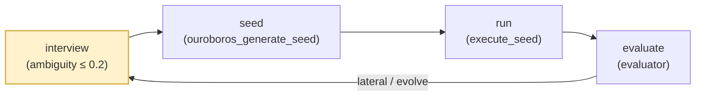

# 01 — Overview

## What is the `interview` skill?

A Socratic interview engine that transforms vague user requests
(e.g., `"build a payment module"`) into a bounded set of clarified
requirements with a numerical **ambiguity score ≤ 0.2**. It is the entry
gate of the Ouroboros evolutionary loop and is the only stage that may
block downstream work until its score passes.

## 5W1H

### Who invokes it
The end user, via one of:

- `ooo interview [topic]` (primary command, routed by `CLAUDE.md` table)
- `/ouroboros:interview [topic]` (Claude Code slash-command alias)
- Natural language triggers `"interview me"` or `"clarify requirements"`
  (declared in `skills/interview/SKILL.md`)

The command file `/Users/brandonwie/dev/personal/ouroboros/commands/interview.md`
is a one-line pointer that delegates to the skill:

```
Read the file at `${CLAUDE_PLUGIN_ROOT}/skills/interview/SKILL.md` using the Read tool and follow its instructions exactly.
```

### When it runs
Before Seed generation. Nothing downstream (`ooo seed`, `ooo run`,
`ooo evaluate`) is intended to execute until an interview has produced a
low-ambiguity session artifact that `ouroboros_generate_seed` can load by
`session_id`.

### Where it runs
Two execution surfaces — chosen at runtime by Step 0.5 of SKILL.md:

- **Path A (MCP mode, preferred):** the `ouroboros_interview` MCP tool
  runs server-side inside the Ouroboros Python process; state is
  persisted to disk; ambiguity is scored by an LLM call.
- **Path B (fallback):** the main Claude session adopts the role defined
  in `src/ouroboros/agents/socratic-interviewer.md` and drives the
  interview in-conversation without persistence.

Step 0.5 is not a preference — it is a hard contract: the skill
*requires* `ToolSearch` with query `"+ouroboros interview"` before
picking a path. MCP tools here are deferred; they do not appear in the
Claude tool list until loaded.

### What problem it solves
Most AI-coding failures are **input failures, not model failures**. When
a user asks for `"a payment module"`, ten important decisions are
already implicit (provider, currency, webhook behaviour, refund policy,
idempotency, auth, rate-limit strategy, storage, observability, test
scope). Interview surfaces those decisions before any code is written,
and refuses to hand off until the surfacing has reduced ambiguity to
≤ 0.2 across four weighted components.

### Why Socratic
The implementation treats each answer as raw material for the next
question rather than a checklist tick. Questions target the biggest
remaining ambiguity (weighted across four dimensions) and route through
four distinct answer-provenance paths so the interview stays balanced
between code facts, user judgment, and external research. The
**dialectic rhythm guard** (detailed in
[./03-dialectic-rhythm.md](./03-dialectic-rhythm.md)) forces a human
question every three non-user answers so the user never loses
situational awareness of what the AI has assumed.

### How it is structured
Five concurrent machineries cooperate:

| Machinery | Location | Role |
|-----------|----------|------|
| Skill definition | `skills/interview/SKILL.md` | 338-line dual-path playbook; tells Claude how to route answers and when to stop |
| Question generator (agent) | `src/ouroboros/agents/socratic-interviewer.md` | Role prompt; pure questioner; loaded by Path B or referenced by Path A |
| Internal perspectives | 5 files under `src/ouroboros/agents/` | Loaded by `InterviewEngine` as LLM prompt data — researcher / simplifier / architect / breadth-keeper / seed-closer |
| Closure audit | `src/ouroboros/agents/seed-closer.md` | Canonical closure criteria; overrides the MCP seed-ready signal if a material decision is still open |
| Scorer | `src/ouroboros/bigbang/ambiguity.py` | Weighted LLM-based clarity score + per-dimension floors + four-milestone labels |
| Engine + state | `src/ouroboros/bigbang/interview.py` | `InterviewEngine`, `InterviewState`, `InterviewRound`, `InterviewStatus`, `InterviewPerspective` |
| MCP handler | `src/ouroboros/mcp/tools/authoring_handlers.py:694–1150` | `InterviewHandler`; exposes five input params; emits `interview.*` events |
| Event sourcing | `src/ouroboros/events/interview.py` | `interview.started`, `interview.response.recorded`, `interview.completed`, `interview.failed` |

## Pipeline role



Interview is the only stage marked `gate`: every other stage can
loop, retry, or evolve its input, but nothing else blocks on
ambiguity scoring.

## Dual-path architecture

```mermaid
flowchart TB
    U[User] -->|"ooo interview [topic]"| SKL[SKILL.md]
    SKL -->|Step 0.5<br/>ToolSearch "+ouroboros interview"| DEF{MCP tool<br/>loaded?}
    DEF -->|yes| PA[Path A: MCP Mode]
    DEF -->|no| PB[Path B: Agent Fallback]

    PA --> MCP["ouroboros_interview<br/>(InterviewHandler)"]
    MCP --> ENG["InterviewEngine<br/>(interview.py)"]
    ENG -->|persist| DISK[("~/.ouroboros/data/<br/>interview_{id}.json")]
    ENG --> SCR["AmbiguityScorer<br/>(ambiguity.py)"]

    PB --> SI["socratic-interviewer.md<br/>(role prompt)"]
    SI --> CTX["Conversation context<br/>(no persistence)"]

    PA -.->|on MCP error| PB

    classDef persist fill:#d5e8d4,stroke:#82b366;
    classDef volatile fill:#ffe6cc,stroke:#d79b00;
    class DISK,SCR,ENG,MCP persist;
    class CTX,SI,PB volatile;
```

The fallback is **not a downgrade** in terms of questioning strategy —
the same Socratic principles apply — but it loses persistence,
server-side ambiguity scoring, and the one-line handoff to
`ouroboros_generate_seed` via `session_id`.

## Handoff contract

Input to interview:

| Field | Source | Notes |
|-------|--------|-------|
| `initial_context` | user topic (positional `$1`) | Free-text; may be vague |
| `cwd` | `$CWD` at invocation | Used by MCP to auto-detect brownfield |

Output of interview (Path A only — Path B keeps data in conversation):

| Artifact | Location | Consumer |
|----------|----------|----------|
| Interview state JSON | `~/.ouroboros/data/interview_{interview_id}.json` | `ouroboros_generate_seed` loads by `session_id` |
| Ambiguity score + breakdown | Embedded in state JSON (`ambiguity_score`, `ambiguity_breakdown`) | Gate check inside `ouroboros_generate_seed` |
| MCP `meta` | Returned in `MCPToolResult` | Client observability |

The MCP `meta` dict carries the signals a downstream tool needs without
re-reading disk:

```python
# authoring_handlers.py:817–822 and :877–884
meta = {
    "session_id": ...,
    "ambiguity_score": ...,    # float or None
    "milestone": ...,          # "initial" | "progress" | "refined" | "ready"
    "seed_ready": ...,         # bool
    "completed": ...,          # bool (only on completion path)
}
```

`Seed` (the downstream immutable spec) is declared at
`src/ouroboros/core/seed.py:155–229`. Its `metadata.ambiguity_score`
defaults to `0.15` and the `metadata.interview_id` field references the
originating session. That reference — not a copy of the interview
transcript — is how the interview's influence travels downstream.

## Source map

| Concern | Absolute path |
|---------|---------------|
| Skill playbook | `/Users/brandonwie/dev/personal/ouroboros/skills/interview/SKILL.md` |
| Command entry | `/Users/brandonwie/dev/personal/ouroboros/commands/interview.md` |
| Interviewer role prompt | `/Users/brandonwie/dev/personal/ouroboros/src/ouroboros/agents/socratic-interviewer.md` |
| Closure criteria | `/Users/brandonwie/dev/personal/ouroboros/src/ouroboros/agents/seed-closer.md` |
| Ontologist (depth chain) | `/Users/brandonwie/dev/personal/ouroboros/src/ouroboros/agents/ontologist.md` |
| Perspective prompts | `/Users/brandonwie/dev/personal/ouroboros/src/ouroboros/agents/{researcher,simplifier,architect,breadth-keeper,seed-closer}.md` |
| Engine + state | `/Users/brandonwie/dev/personal/ouroboros/src/ouroboros/bigbang/interview.py` |
| PM variant engine | `/Users/brandonwie/dev/personal/ouroboros/src/ouroboros/bigbang/pm_interview.py` |
| Ambiguity scorer | `/Users/brandonwie/dev/personal/ouroboros/src/ouroboros/bigbang/ambiguity.py` |
| Event definitions | `/Users/brandonwie/dev/personal/ouroboros/src/ouroboros/events/interview.py` |
| MCP handler | `/Users/brandonwie/dev/personal/ouroboros/src/ouroboros/mcp/tools/authoring_handlers.py` (lines 694–1150) |
| MCP PM handler | `/Users/brandonwie/dev/personal/ouroboros/src/ouroboros/mcp/tools/pm_handler.py` |
| Downstream `Seed` contract | `/Users/brandonwie/dev/personal/ouroboros/src/ouroboros/core/seed.py` (lines 155–229) |
| Tests | `/Users/brandonwie/dev/personal/ouroboros/tests/unit/bigbang/test_interview.py`, `tests/unit/bigbang/test_pm_interview.py` |

## Minimal mental model

> "The interview skill is a two-surface reduction function: it takes an
> initial context (a sentence) and an interactive user (a session) and
> produces a numerically-scored requirements snapshot on disk, plus a
> session id by which the rest of the Ouroboros pipeline refers to it."

Every subsequent doc in this folder elaborates one of the four pieces:

- The **routing** decisions that decide what to do with each generated
  question → [./02-routing-decision-tree.md](./02-routing-decision-tree.md)
- The **rhythm** guards that decide when the interview must let the
  human speak → [./03-dialectic-rhythm.md](./03-dialectic-rhythm.md)
- The **score** that decides when the interview is allowed to end
  → [./04-ambiguity-scoring.md](./04-ambiguity-scoring.md)
- The **state** that carries all of this across rounds and to the next
  stage → [./05-state-and-persistence.md](./05-state-and-persistence.md)

Start with whichever matches the change you want to make, or read in
order for a full tour.
