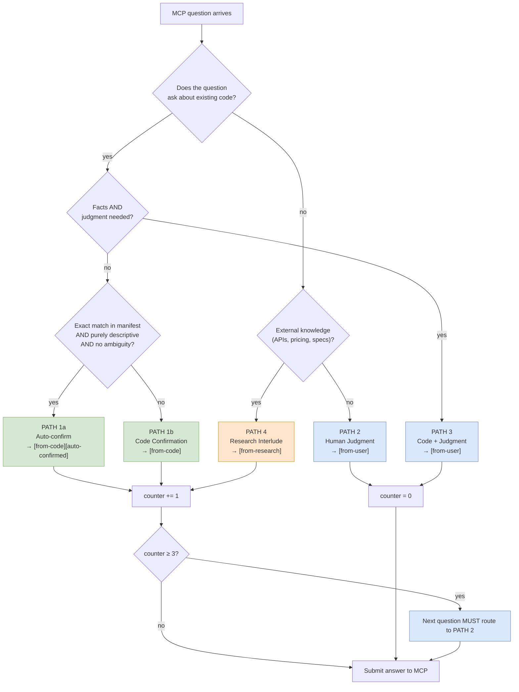

# 02 — Routing decision tree

Every time the MCP question generator produces a question, the main
Claude session must decide **who should answer it** — the code, the
user, an external source, or some combination. That decision is the
single most behaviour-shaping piece of the skill, because the answer
prefix the session returns to MCP (`[from-code]`, `[from-user]`,
`[from-research]`, `[from-code][auto-confirmed]`) influences ambiguity
scoring, rhythm counters, and the seed-closer audit.

This doc inventories the full decision surface — the two boot steps
(version check, MCP load), the five routing paths, and the fallback
trigger.

## Boot steps (before any routing)

Two mandatory steps precede the interview loop, declared at
`skills/interview/SKILL.md:27–80`:

### Step 0 — Version check

The skill fetches the latest GitHub release tag with a 3-second
timeout, compares it against the local
`.claude-plugin/plugin.json`, and if a newer version exists, asks the
user via `AskUserQuestion` whether to update now or skip. The update
path runs in order:

1. `claude plugin marketplace update ouroboros`
2. `claude plugin update ouroboros@ouroboros`
3. Python MCP package upgrade, detected by checking `uv tool list`,
   then `pipx list`, then falling back to a print-only `pip install
   --upgrade ouroboros-ai` instruction.

Silently skipped on version match, timeout, 403/429, or parse
failure. This step is the reason interview sometimes pauses for a
few seconds before generating the first question.

### Step 0.5 — Load MCP tools (deferred tools)

```
ToolSearch query: "+ouroboros interview"
```

Ouroboros's MCP tools are registered as **deferred tools** — they do
not appear in Claude's immediate tool list and cannot be called until
explicitly loaded. The skill is emphatic about this
(`SKILL.md:80`):

> IMPORTANT: Do NOT skip this step. Do NOT assume MCP tools are
> unavailable just because they don't appear in your immediate tool
> list. They are almost always available as deferred tools that need
> to be loaded first.

The tool name returned from a successful load is
`mcp__plugin_ouroboros_ouroboros__ouroboros_interview`. The skill
routes based on the binary outcome: tool loaded → Path A; no match →
Path B.

## Path A vs Path B

| Dimension | Path A (MCP) | Path B (Fallback) |
|-----------|--------------|-------------------|
| Question generator | `ouroboros_interview` MCP tool | Claude session adopting `socratic-interviewer.md` |
| State | Persisted to disk (see [./05-state-and-persistence.md](./05-state-and-persistence.md)) | Conversation context only |
| Ambiguity scoring | Server-side LLM every round | Absent — qualitative judgement |
| Seed handoff | `session_id` → `ouroboros_generate_seed` | Re-run context into seed step |
| Retries on failure | 2 retries in SKILL.md step, then switch to Path B | Not applicable |
| When it runs | MCP tool loaded in Step 0.5 | MCP tool not available |

Both paths share the same **five routing paths** for each question.

## The five routing paths

Declared at `SKILL.md:108–198`. Purpose: categorise every question by
the kind of authority needed to answer it.



### PATH 1a — Auto-confirm

Trigger: **all three** conditions (`SKILL.md:118–125`):

1. The answer is an **exact match** in a manifest or config file
   (`pyproject.toml`, `package.json`, `Dockerfile`, `go.mod`,
   `.env.example`, …).
2. The answer is **purely descriptive** — describes what exists, not
   what the new feature should do.
3. No ambiguity — a single, clear answer (not multiple candidates).

Behaviour:

- Send answer to MCP immediately with `[from-code][auto-confirmed]`
  prefix.
- Show non-blocking notification to user:
  `"ℹ️ Auto-confirmed: Python 3.12, FastAPI framework (pyproject.toml)"`.
- User can correct at any time by saying "that's wrong" — the session
  must re-send the correction.
- Increment the dialectic rhythm counter
  (see [./03-dialectic-rhythm.md](./03-dialectic-rhythm.md)).

Examples listed in SKILL.md:133–138: language, framework, runtime
version, package manager, CI/CD tool.

### PATH 1b — Code Confirmation

Trigger: codebase has relevant info but confidence is not high
enough for auto-confirm — inferred from patterns, multiple candidates,
or no manifest match.

Behaviour: present findings via `AskUserQuestion` as a confirmation
question. Verbatim template from `SKILL.md:143–156`:

```json
{
  "questions": [{
    "question": "MCP asks: What auth method does the project use?\n\nI found: JWT-based auth in src/auth/jwt.py\n\nIs this correct?",
    "header": "Q<N> — Code Confirmation",
    "options": [
      {"label": "Yes, correct", "description": "Use this as the answer"},
      {"label": "No, let me correct", "description": "I'll provide the right answer"}
    ],
    "multiSelect": false
  }]
}
```

Answer sent to MCP with `[from-code]` prefix. Counter increments.

### PATH 2 — Human Judgment

Trigger: goals, vision, acceptance criteria, business logic,
preferences, tradeoffs, scope, or desired behaviour for **new**
features.

Behaviour: present question directly to user via `AskUserQuestion`
with suggested options. Answer sent to MCP with `[from-user]` prefix.
Counter **resets** to 0.

SKILL.md explicitly notes (`:198`): **"When in doubt, use PATH 2. It's
safer to ask the user than to guess."**

### PATH 3 — Code + Judgment

Trigger: code contains relevant facts, but the question also requires
judgment (example from `SKILL.md:168`:
`"I see a saga pattern in orders/. Should payments use the same?"`).

Behaviour:

1. Read relevant code first.
2. Present **both** the code findings and the question to the user.
3. If any part requires judgment, route the **entire** question to the
   user.
4. Prefix with `[from-user]` (human made the decision).

Counter resets.

### PATH 4 — Research Interlude

Trigger: third-party APIs, pricing models, library capabilities,
version compatibility, security advisories, industry standards — not
answerable from the local codebase.

Behaviour: `WebFetch` / `WebSearch`, then present findings as a
confirmation question (same pattern as PATH 1b). Answer prefix
`[from-research]`. Counter increments.

Important boundary from `SKILL.md:195–197`:

> Facts, not decisions: "Stripe rate limit is 100 req/s" is research.
> "We should use Stripe" is a DECISION — route to PATH 2.

## The prefix contract

The prefix is the interview's audit trail. MCP does not verify the
claim — the trust relationship is: **the main Claude session is
accountable for the prefix it attaches**, and the user's confirmation
loop is how that accountability is enforced.

| Prefix | Sent when | Increments counter? |
|--------|-----------|---------------------|
| `[from-code][auto-confirmed]` | PATH 1a — manifest-backed, descriptive, single answer | yes |
| `[from-code]` | PATH 1b / PATH 3 code lookup step | yes (1b), no (3 — user still decides) |
| `[from-user]` | PATH 2 / PATH 3 | no (resets counter) |
| `[from-research]` | PATH 4 — external lookup with user confirmation | yes |

## Retry and fallback

`SKILL.md:253–261` describes a narrow retry protocol for Path A:

- If the MCP returns `is_error=true` with `meta.recoverable=true`,
  tell the user `"Question generation encountered an issue. Retrying..."`
  and call `ouroboros_interview(session_id=...)` to resume. **Max 2
  retries.**
- State and previously recorded answers are persisted before the
  error, so resume does not lose progress.
- Still failing after retries: switch to Path B and continue from
  where the session left off. The user sees the message
  `"MCP is having trouble. Switching to direct interview mode."`.

This is the only normal case where the session drops from Path A to
Path B mid-run. Everything else (network blip, transient rate limit)
is expected to be invisible via the retry.

## Seed-ready Acceptance Guard

Even when MCP returns `seed_ready: true`, the session does **not**
relay completion directly. It applies the canonical closure criteria
from `src/ouroboros/agents/seed-closer.md` and, if it finds a material
gap, overrides the signal with the exact wording from `SKILL.md:218–231`:

> "MCP says seed-ready, but I am not accepting it yet because `<gap>`."

See [./03-dialectic-rhythm.md](./03-dialectic-rhythm.md) for the full
closure audit.

## Path B divergences

Path B shares the same five routing paths but with these operational
differences (`SKILL.md:265–282`):

| Aspect | Path B behaviour |
|--------|------------------|
| Question source | Claude session following `socratic-interviewer.md` |
| Pre-scan | `Glob` for common manifests; `Read`/`Grep` on key files to pre-seed confirmation-style questions |
| Presentation | Still uses `AskUserQuestion` with contextually relevant suggested answers |
| Persistence | None — lives in conversation context |
| Completion | Still applies the Seed-ready Acceptance Guard before suggesting `ooo seed` |
| Ambiguity ledger | Mentally tracked; breadth-check every few rounds; the same rhythm guard applies |

The shared routing table is what keeps the two paths interchangeable
in user experience, even though the underlying state and scoring are
very different. When forking, this is the key invariant to preserve:
the prefix contract + rhythm guard + acceptance guard apply
regardless of whether there is a server-side state.

## Example session (verbatim from SKILL.md:302–333)

```
User: ooo interview Add payment module to existing project

MCP Q1: "Is this a greenfield or brownfield project?"
→ PATH 1a: exact match in pyproject.toml + src/ directory
→ ℹ️ Auto-confirmed: Brownfield, Python 3.12 / FastAPI (pyproject.toml)
→ [from-code][auto-confirmed] sent to MCP (counter: 1)

MCP Q2: "What payment provider will you use?"
→ PATH 2: human decision — no code can answer this
→ User: "Stripe"
→ [from-user] sent to MCP (counter reset to 0)

MCP Q3: "What authentication method does the project use?"
→ PATH 1b: found src/auth/jwt.py but inferred (not manifest)
→ "I found JWT-based auth in src/auth/jwt.py. Is this correct?"
→ User: "Yes, correct"
→ [from-code] sent to MCP (counter: 1)

MCP Q4: "How should payment failures affect order state?"
→ PATH 2: design decision
→ User: "Saga pattern for rollback"
→ [from-user] sent to MCP (counter reset to 0)

MCP Q5: "What are the acceptance criteria for this feature?"
→ PATH 2: requires human judgment
→ User: "Successful Stripe charge, webhook handling, refund support"

📍 Next: `ooo seed` to crystallize these requirements into a specification
```

## What this doc does NOT cover

- The rhythm guard counter mechanics and seed-closer override —
  see [./03-dialectic-rhythm.md](./03-dialectic-rhythm.md).
- How `[from-user]` vs `[from-code]` affect the ambiguity scorer's
  internal weighting — see [./04-ambiguity-scoring.md](./04-ambiguity-scoring.md).
- How `session_id` persists across these paths —
  see [./05-state-and-persistence.md](./05-state-and-persistence.md).
