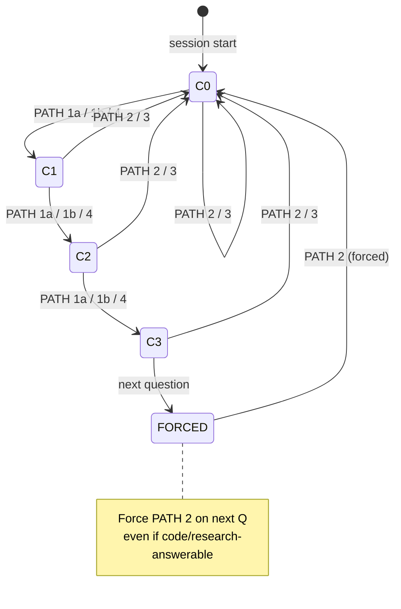

# 03 — Dialectic rhythm and closure

Two guards keep the interview honest:

1. **Dialectic Rhythm Guard** — forces a user question every three
   non-user answers, so the user stays in the loop.
2. **Seed-ready Acceptance Guard** — overrides the numerical
   "seed-ready" signal with a qualitative closure audit, so the
   interview doesn't close on technicalities.

Both are declared in `skills/interview/SKILL.md` and enforced by the
main Claude session, not by the MCP server. The MCP issues questions
and scores; the session decides when to involve the human and when to
stop.

## The Dialectic Rhythm Guard

Section header: `#### Dialectic Rhythm Guard`
Location: `skills/interview/SKILL.md:238–251`

Verbatim:

> Track consecutive non-user answers (PATH 1a auto-confirms, PATH 1b
> code confirmations, and PATH 4 research confirmations). If **3
> consecutive questions** were answered without direct user judgment
> (PATH 1a, 1b, or PATH 4), the next question MUST be routed to
> **PATH 2** (directly to user), even if it appears code- or
> research-answerable.
>
> This preserves the Socratic dialectic rhythm — the interview is
> with the human, not the codebase or external docs. Auto-confirmed
> answers especially need this guard: if the AI answers too many
> questions on its own, the user loses awareness of what the AI is
> assuming about their project.
>
> Reset the counter whenever user answers directly (PATH 2 or PATH 3).

### State machine

| State | Meaning | Next-question rule |
|-------|---------|---------------------|
| `C0` | 0 consecutive non-user answers | Normal routing (per [./02-routing-decision-tree.md](./02-routing-decision-tree.md)) |
| `C1`, `C2` | 1 or 2 consecutive non-user answers | Normal routing |
| `C3` | 3 consecutive non-user answers | **Next question MUST be PATH 2**, even if otherwise auto-confirmable |
| `FORCED` | Guard-forced PATH 2 in flight | After the user answers, counter resets to `C0` |

### Why three?

Three is a floor, not a ceiling. The skill is optimising for two
forces in tension:

- **Too few auto-confirms** → every round becomes a yes/no confirmation
  dialog → user fatigue, slow interviews, no use of the codebase
  advantage.
- **Too many auto-confirms** → the AI drifts into silent
  decision-making; the user sees `ℹ️ Auto-confirmed: ...`
  notifications but does not engage; a misread manifest becomes a
  load-bearing assumption.

Three is empirically the point where the user still remembers what
the AI inferred in the previous two rounds. Lowering it to 2 makes
the interview chattier; raising it to 5 increases the risk of the
user rubber-stamping a chain of AI guesses. See
[./08-customization-guide.md](./08-customization-guide.md) for the
exact line to change if forking.

### What counts as "non-user"

From `SKILL.md:240–241`:

| Prefix | Counter effect |
|--------|----------------|
| `[from-code][auto-confirmed]` (PATH 1a) | increment |
| `[from-code]` (PATH 1b) | increment |
| `[from-research]` (PATH 4) | increment |
| `[from-user]` (PATH 2) | **reset to 0** |
| `[from-user]` from PATH 3 | **reset to 0** (human made the decision even if code was read first) |

The key insight: PATH 3 reads code *and* asks the user. Its prefix
is `[from-user]` and it resets the counter — because even though code
was consulted, the authority is the user.

## The Seed-ready Acceptance Guard

Location: `skills/interview/SKILL.md:218–231`
Canonical criteria source: `src/ouroboros/agents/seed-closer.md`

The MCP-level completion logic lives in `_complete_interview_response`
and is gated by `qualifies_for_seed_completion()` (see
[./04-ambiguity-scoring.md](./04-ambiguity-scoring.md)). But even
when MCP returns `meta.seed_ready: True`, the main Claude session
does **not** relay completion blindly.

Verbatim from SKILL.md:

> When MCP signals seed-ready, do NOT relay completion blindly.
> Before announcing completion or suggesting `ooo seed`, apply the
> canonical Seed Closer criteria from
> `src/ouroboros/agents/seed-closer.md` as the single source of truth
> for closure readiness. Run the check from the main session's
> perspective, including any code, research, or brownfield context
> MCP did not see.
>
> If any material decision remains unresolved, do not announce
> seed-ready. If the local challenge finds a material gap, explicitly
> override the MCP signal: `"MCP says seed-ready, but I am not
> accepting it yet because <gap>."`
> Explain the gap briefly and ask the single highest-impact
> follow-up question, routed through PATH 2 or PATH 3 as appropriate.

### Why the override exists

The MCP scorer sees only the interview transcript plus cached
scoring. It does not see:

- Code the main session read to answer a PATH 1b question.
- External research the main session performed in PATH 4.
- Brownfield context the main session has implicitly accumulated
  across the conversation.

A transcript-only scorer can produce a numerically clean
"seed-ready" score while a structural ambiguity is still visible in
the session's actual knowledge. The guard lets the richer observer
(the Claude session) overrule the server scorer.

### The audit checklist

From `seed-closer.md`, the main session asks each of these before
accepting closure:

1. **Scope, non-goals, outputs, and verification already explicit?**
   (`:22`) — the four "must be known" dimensions for a Seed.
2. **Material blockers resolved?** (`:26–30`) — specifically for
   brownfield: ownership/SSoT, protocol or API contract,
   lifecycle/recovery, migration, cross-client impact, verification.
3. **Unasked alternatives from code / research / architecture?**
   (`:27`) — did the session find something during PATH 1/3/4 that
   suggests a different approach?
4. **Not over-interviewing?** (`:31–34`) — remaining uncertainty must
   be more than stylistic; repeat restatement is a signal to close.
5. **Ready to ask the closure question directly?** (`:36–39`) — convert
   late-stage refinement into an explicit "should we stop here?".

The signature closure questions the session asks itself
(`seed-closer.md:46–54`):

- Is there any ambiguity left that would materially change
  implementation?
- Are scope, non-goals, outputs, and verification expectations
  already clear enough for a Seed?
- For brownfield or system-level work, are ownership, protocol/API
  contract, lifecycle/recovery, migration, cross-client impact, and
  verification clear enough to execute?
- Did code or research reveal an alternative path that would change
  implementation and needs a human decision?
- Would another question change execution, or just polish wording?
- Should we stop the interview here and move to seed generation?
- What is the smallest remaining clarification needed before we can
  proceed?

## Stop conditions (from the interviewer role)

Complementing the Acceptance Guard, the `socratic-interviewer.md`
agent has its own stop conditions (`:46–49`) that apply during
question generation itself:

> - Prefer ending the interview once scope, non-goals, outputs, and
>   verification expectations are all explicit enough to generate a
>   Seed.
> - When the conversation is mostly refining wording or very narrow
>   edge cases, ask whether to stop and move to Seed generation
>   instead of opening another deep sub-question.
> - If the user explicitly signals "this is enough", "let's generate
>   the seed", or equivalent, treat that as a strong cue to ask a
>   final closure question rather than continuing the drill-down.

These three conditions describe when the **generator** should ask a
closure question. The Acceptance Guard describes when the **session**
should accept one.

## Ambiguity ledger (breadth tracking)

Not a formal guard, but a parallel mechanism the skill uses to keep
the interview shaped like the user's original request:

From `socratic-interviewer.md:39–44`:

> - At the start of the interview, infer the main ambiguity tracks
>   in the user's request and keep them active.
> - If the request contains multiple deliverables or a list of
>   findings/issues, treat those as separate tracks rather than
>   collapsing onto one favorite subtopic.
> - After a few rounds on one thread, run a breadth check: ask
>   whether the other unresolved tracks are already fixed or still
>   need clarification.

The `breadth-keeper` perspective (see
[./06-agents-and-roles.md](./06-agents-and-roles.md)) exists to
enforce this rule at the prompt level. Together with the rhythm guard
they form a loose 2D discipline:

- **Rhythm guard** (time axis) — forces user engagement at least
  every 3 rounds.
- **Breadth keeper** (topic axis) — forces a multi-track view at
  least every few rounds.

Drop either and the interview degrades. Drop both and it becomes
either a yes-man chain or a rabbit hole.

## Path B behaviour

Path B does not have a numerical seed-ready signal, so the Acceptance
Guard becomes the **only** closure mechanism. The rhythm guard still
applies — the Claude session tracks the counter mentally and forces a
PATH 2 every three non-user answers, same as Path A.

## Summary — what to edit and where

| Change | Where | Effect |
|--------|-------|--------|
| Rhythm threshold (3 → N) | `SKILL.md` `#### Dialectic Rhythm Guard` | More/less user engagement |
| Add a new counter-resetting prefix | `SKILL.md` `#### Dialectic Rhythm Guard` + PATH rules | Changes which paths are "user" |
| Closure criteria | `seed-closer.md` | Affects both perspective prompt **and** acceptance audit (see [./06-agents-and-roles.md](./06-agents-and-roles.md)) |
| Stop conditions | `socratic-interviewer.md:46–49` | Changes when the generator suggests closure |
| Breadth check frequency | `socratic-interviewer.md:39–44` + `breadth-keeper.md` | Changes when zoom-outs fire |

See [./08-customization-guide.md](./08-customization-guide.md) for
the full fork matrix.
