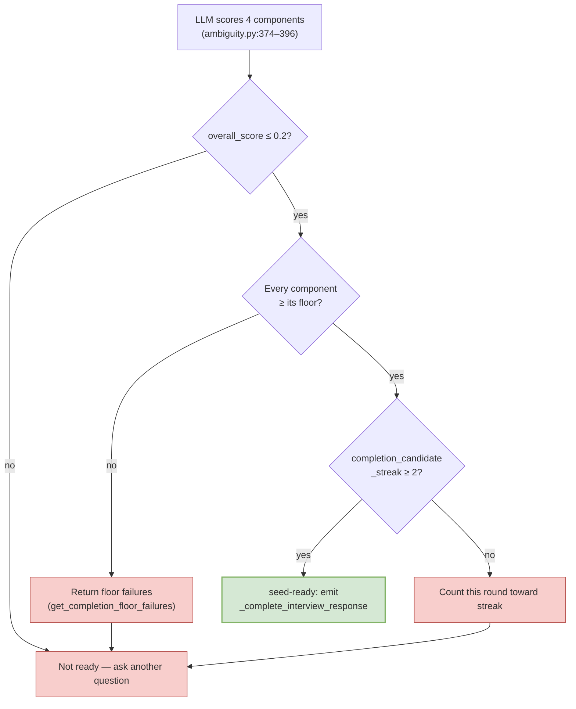

# 04 — Ambiguity Scoring

The interview's numerical gate is concentrated in **one file** —
`/Users/brandonwie/dev/personal/ouroboros/src/ouroboros/bigbang/ambiguity.py`.
Every behaviour in this doc is controlled by a constant or a small
function in that file, which makes scoring the most self-contained
part of the skill.

## The five constants that govern everything

Verbatim from `ambiguity.py:29–56`:

```python
# Threshold for allowing Seed generation (NFR6)
AMBIGUITY_THRESHOLD = 0.2
SEED_CLOSER_ACTIVATION_THRESHOLD = 0.25
AUTO_COMPLETE_STREAK_REQUIRED = 2

# Minimum per-dimension clarity required before interview auto-completion.
GOAL_CLARITY_FLOOR = 0.75
CONSTRAINT_CLARITY_FLOOR = 0.65
SUCCESS_CRITERIA_CLARITY_FLOOR = 0.70
BROWNFIELD_CONTEXT_CLARITY_FLOOR = 0.60

# Weights for greenfield score components (3 dimensions)
GOAL_CLARITY_WEIGHT = 0.40
CONSTRAINT_CLARITY_WEIGHT = 0.30
SUCCESS_CRITERIA_CLARITY_WEIGHT = 0.30

# Weights for brownfield score components (4 dimensions)
BROWNFIELD_GOAL_CLARITY_WEIGHT = 0.35
BROWNFIELD_CONSTRAINT_CLARITY_WEIGHT = 0.25
BROWNFIELD_SUCCESS_CRITERIA_CLARITY_WEIGHT = 0.25
BROWNFIELD_CONTEXT_CLARITY_WEIGHT = 0.15

# Temperature for reproducible scoring
SCORING_TEMPERATURE = 0.1
```

| Constant | Purpose | Effect when changed |
|----------|---------|---------------------|
| `AMBIGUITY_THRESHOLD = 0.2` | Single gate for `is_ready_for_seed` | Lowering → stricter interview; raising → easier closure |
| `SEED_CLOSER_ACTIVATION_THRESHOLD = 0.25` | When to start running the seed-closer check during generation | Lower = closer activates only for near-ready sessions |
| `AUTO_COMPLETE_STREAK_REQUIRED = 2` | Consecutive seed-ready scores needed before auto-completion fires | Higher = more stability before ending |
| Four `*_FLOOR` constants | Per-dimension clarity minimums | Any component below its floor blocks auto-completion even when `overall_score ≤ 0.2` |
| Weights (greenfield + brownfield) | Relative importance of each clarity dimension | Must sum to 1.0 per mode |
| `SCORING_TEMPERATURE = 0.1` | LLM reproducibility | Lower = less variation run-to-run |

## The formula

Clarity ∈ [0.0, 1.0] per component. Ambiguity = 1 − weighted sum.

### Greenfield (3 components)

```
Clarity = 0.40·Goal + 0.30·Constraint + 0.30·Success
Ambiguity = 1 − Clarity
```

### Brownfield (4 components)

```
Clarity   = 0.35·Goal + 0.25·Constraint + 0.25·Success + 0.15·Context
Ambiguity = 1 − Clarity
```

The brownfield mode is selected by `is_brownfield` on `InterviewState`
(set when `cwd` contains a detectable project manifest — see
[./05-state-and-persistence.md](./05-state-and-persistence.md)).

## Gate logic

Three independent checks combine to allow auto-completion:



In code:

```python
# ambiguity.py:234–243
def qualifies_for_seed_completion(
    score: AmbiguityScore,
    *,
    is_brownfield: bool,
) -> bool:
    """Return True when ambiguity and all required component floors are satisfied."""
    return score.is_ready_for_seed and not get_completion_floor_failures(
        score,
        is_brownfield=is_brownfield,
    )
```

The streak dimension is held on the `InterviewState` as
`completion_candidate_streak` (see
[./05-state-and-persistence.md](./05-state-and-persistence.md)) and
incremented/reset by `_update_completion_candidate_streak()` in the
handler. Two consecutive "seed-ready + all floors met" scores unlock
completion — one lucky score is not enough.

## Floor failure reporting

When overall score passes but a component is too low, the scorer
reports exactly which dimensions need work — not just a blanket "keep
going":

```python
# ambiguity.py:206–231
def get_completion_floor_failures(
    score: AmbiguityScore,
    *,
    is_brownfield: bool,
) -> list[str]:
    # Returns entries like:
    #   "Goal Clarity 0.68 < 0.75"
    #   "Context Clarity missing (< 0.60)"
    ...
```

This list is what the MCP handler turns into the
`"Cannot complete yet — …"` message (`authoring_handlers.py:801–813`)
that the Claude session shows back to the user.

## Milestones

Four semantic labels are defined at `ambiguity.py:63–101` so the
downstream tooling (and the LLM prompt itself) can adapt strategy to
stage rather than reading a raw float:

| Milestone | Threshold (score ≤) | Description |
|-----------|---------------------|-------------|
| `INITIAL` | 1.0 | "Core requirements identified. Major gaps in constraints and success criteria." |
| `PROGRESS` | 0.4 | "Most requirements captured. Some details and edge cases missing." |
| `REFINED` | 0.3 | "Success criteria partially defined. Edge cases and non-goals remain." |
| `READY` | 0.2 | "All criteria concrete and testable. Ready for Seed generation." |

`get_milestone(score)` walks the list from the tightest threshold
upward and returns the most advanced match. `get_next_milestone(score)`
walks top-down to answer "what does the LLM need to aim for next?" —
used by `_build_ambiguity_snapshot_prompt` in `interview.py` so the
question generator knows whether to broaden, deepen, or close.

## The scorer itself

`AmbiguityScorer` (`ambiguity.py:246–282`) wraps an LLM call:

| Field | Default | Meaning |
|-------|---------|---------|
| `model` | `get_clarification_model()` | LLM model id |
| `temperature` | `SCORING_TEMPERATURE` = 0.1 | Near-deterministic |
| `initial_max_tokens` | 512 | Adaptive — doubles on truncation |
| `max_retries` | 10 | Parse errors + provider errors |
| `max_format_error_retries` | 5 | Non-truncation format errors |

Key behaviours:

- **Adaptive token allocation** — if the LLM output is truncated, the
  next retry doubles `max_tokens`. `MAX_TOKEN_LIMIT: int | None = None`
  at `ambiguity.py:55` means "rely on the model's native context
  window" unless you set a hard cap.
- **Deferral awareness** — `score()` accepts an `additional_context`
  string (e.g., decide-later items from a PM interview). The prompt
  instructs the LLM to score only what is present and answerable; items
  explicitly deferred **must not** reduce clarity
  (`ambiguity.py:302–304`). Without this, PM flows would punish
  intentional parking.
- **Per-component justification** — the response model
  (`ScoreBreakdown`, `ambiguity.py:155–180`) carries a
  `ComponentScore` per dimension with a `justification: str` field.
  That is what surfaces in the user-facing floor failure messages.

## Where the gate actually fires

Three gate points exist, all in the handler (see
[./05-state-and-persistence.md](./05-state-and-persistence.md) for
exact lines):

1. **Pre-completion:** `_score_interview_state()` every round, to keep
   `completion_candidate_streak` accurate.
2. **Attempted completion:** `_ambiguity_gate_response()` — refuses if
   `not qualifies_for_seed_completion(...)` and returns the
   `Cannot complete yet — …` message with the specific floor failures.
3. **Accepted completion:** `_complete_interview_response()` — emits
   `interview.completed`, writes the final state, returns seed-ready
   meta.

In Path B (agent fallback) there is no programmatic scorer —
completion is decided by the Claude session applying the closure
criteria from `seed-closer.md`. The numerical threshold becomes a
qualitative judgment.

## Quick "what would I change" table

| Goal | Edit | Expected behaviour change |
|------|------|---------------------------|
| Allow slightly fuzzier specs | Raise `AMBIGUITY_THRESHOLD` to 0.25 | More sessions close without drilling edge cases |
| Force stricter goal wording | Raise `GOAL_CLARITY_FLOOR` to 0.85 | Floor failures block closure until the goal is near-perfectly worded |
| Make scoring cheaper | Lower `initial_max_tokens` to 256 + set `max_retries=3` | Faster + cheaper + riskier on truncation |
| Treat context as essential, not optional | Raise `BROWNFIELD_CONTEXT_CLARITY_WEIGHT` to 0.25, rebalance others | Brownfield interviews won't pass until codebase context is captured |
| Stop auto-completion entirely | Raise `AUTO_COMPLETE_STREAK_REQUIRED` to a very high number | Seed-ready only on explicit user request |

See [./08-customization-guide.md](./08-customization-guide.md) for the
full fork matrix.
