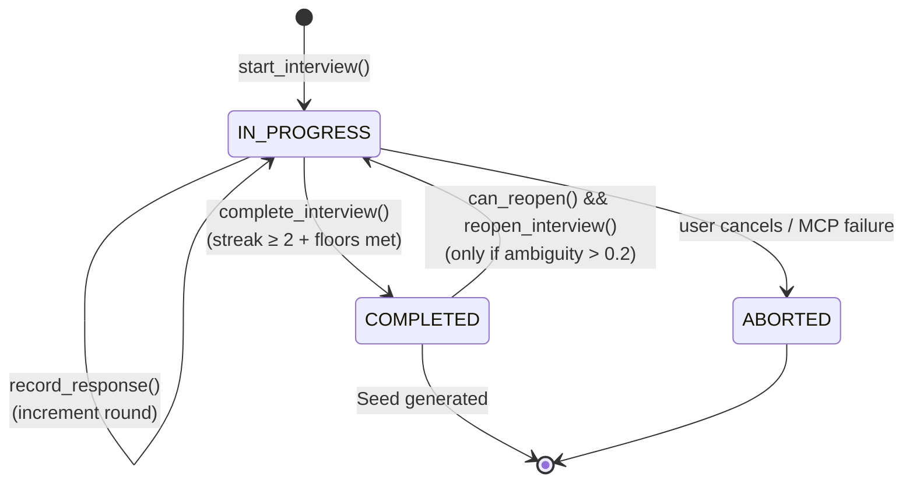

# 05 — State and persistence

Path A keeps every interview round on disk. Path B keeps nothing. This
asymmetry is the single biggest reason to bias toward Path A when
forking, and it is why `ouroboros_generate_seed` can only work from a
Path-A session id.

## Storage layout

| Kind | Path | Produced by |
|------|------|-------------|
| Greenfield / default interview | `~/.ouroboros/data/interview_{interview_id}.json` | `InterviewEngine._state_file_path()` (`interview.py:243–252`) |
| PM / brownfield meta | `~/.ouroboros/data/pm_meta_{session_id}.json` | `pm_interview.py` (see [./07-pm-variant.md](./07-pm-variant.md)) |
| Seed artifact (downstream) | `~/.ouroboros/data/seed_{seed_id}.json` or `pm_seed_{id}.json` | `ouroboros_generate_seed` after interview passes gate |

`state_dir` defaults to `Path.home() / ".ouroboros" / "data"` and is
created on engine construction (`interview.py:234`, `:239–241`). The
directory is shared across all sessions, so `interview_id` must be
globally unique — the MCP layer supplies a short hash when none is
passed.

## `InterviewState` schema

Pydantic v2 model at `src/ouroboros/bigbang/interview.py:114–194`.

```python
class InterviewState(BaseModel):
    interview_id: str
    status: InterviewStatus = InterviewStatus.IN_PROGRESS
    rounds: list[InterviewRound] = Field(default_factory=list)
    initial_context: str = ""
    created_at: datetime = Field(default_factory=lambda: datetime.now(UTC))
    updated_at: datetime = Field(default_factory=lambda: datetime.now(UTC))
    is_brownfield: bool = False
    codebase_paths: list[dict[str, str]] = Field(default_factory=list)
    codebase_context: str = ""
    explore_completed: bool = False
    ambiguity_score: float | None = Field(default=None, ge=0.0, le=1.0)
    ambiguity_breakdown: dict[str, Any] | None = None
    completion_candidate_streak: int = Field(default=0, ge=0)
```

| Field | Role | Who writes it |
|-------|------|---------------|
| `interview_id` | Primary key, filename segment | Engine on create |
| `status` | `IN_PROGRESS` / `COMPLETED` / `ABORTED` | Engine + handler |
| `rounds` | Append-only list of `InterviewRound` | `engine.record_response()` |
| `initial_context` | First user message | `start_interview` |
| `is_brownfield` | Drives weights and adds context dimension | Auto-detected from `cwd` at start |
| `codebase_paths` / `codebase_context` / `explore_completed` | Brownfield enrichment captured pre-interview | Brownfield explorer |
| `ambiguity_score` / `ambiguity_breakdown` | Cached scorer output per round | `_score_interview_state()` in handler |
| `completion_candidate_streak` | Consecutive seed-ready rounds (see [./04-ambiguity-scoring.md](./04-ambiguity-scoring.md)) | `_update_completion_candidate_streak()` |

Derived properties worth knowing:

```python
# interview.py:144–170
@property
def current_round_number(self) -> int: return len(self.rounds) + 1

@property
def is_complete(self) -> bool:
    return self.status == InterviewStatus.COMPLETED

@property
def can_reopen(self) -> bool:
    """A completed interview is reopenable only when its stored ambiguity
    score exceeds the seed-generation threshold — i.e. it was completed
    prematurely and is now in a deadlock."""
    return (
        self.is_complete
        and self.ambiguity_score is not None
        and self.ambiguity_score > self._SEED_READY_THRESHOLD
    )
```

`can_reopen` exists because the engine does not want to resurrect a
healthy completion — but it will unlock a deadlocked one (completed
but ambiguity > 0.2) so the user can add rounds to push it through.

## Status lifecycle



## Rounds

```python
# interview.py:98–111
class InterviewRound(BaseModel):
    round_number: int = Field(ge=1)  # No upper limit
    question: str
    user_response: str | None = None
    timestamp: datetime = Field(default_factory=lambda: datetime.now(UTC))
```

Two soft limits exist as prompt hints, not enforcement:

```python
# interview.py:35–36
MIN_ROUNDS_BEFORE_EARLY_EXIT = 3    # Score only after 3 rounds
DEFAULT_INTERVIEW_ROUNDS = 10       # Reference value for prompts
```

`MIN_ROUNDS_BEFORE_EARLY_EXIT` is load-bearing: the scorer does not
run (and the completion streak cannot be incremented) until the user
has answered three questions. This prevents a sub-second "seed-ready"
false positive on a well-worded first prompt.

## Internal perspectives

Each scoring prompt is enriched with one of five "perspectives",
loaded lazily from agent markdown files:

```python
# interview.py:42–49
class InterviewPerspective(StrEnum):
    RESEARCHER = "researcher"
    SIMPLIFIER = "simplifier"
    ARCHITECT = "architect"
    BREADTH_KEEPER = "breadth-keeper"
    SEED_CLOSER = "seed-closer"
```

The loader (`interview.py:62–87`) pulls each perspective's
`system_prompt`, `approach_instructions`, and `question_templates`
from `src/ouroboros/agents/{name}.md` via
`ouroboros.agents.loader.load_persona_prompt_data`. In other words:
**those five agent md files are not documentation — they are prompt
data fed into the interview loop every round**. Editing them changes
the question generator's behaviour without touching Python.

See [./06-agents-and-roles.md](./06-agents-and-roles.md) for which
perspective drives which stage.

## MCP tool — `ouroboros_interview`

Full definition at `authoring_handlers.py:887–942`:

```python
MCPToolDefinition(
    name="ouroboros_interview",
    description=(
        "Interactive interview for requirement clarification. "
        "Start a new interview with initial_context, resume with session_id, "
        "or record an answer to the current question. "
        "In plugin mode, returns a delegation receipt "
        "(status=delegated_to_subagent) and the interview executes in an "
        "OpenCode Task pane — the real session_id is returned there."
    ),
    parameters=(
        MCPToolParameter(name="initial_context", type=STRING, required=False,
            description="Initial context to start a new interview session"),
        MCPToolParameter(name="session_id", type=STRING, required=False,
            description="Session ID to resume an existing interview"),
        MCPToolParameter(name="answer", type=STRING, required=False,
            description="Response to the current interview question"),
        MCPToolParameter(name="cwd", type=STRING, required=False,
            description="Working directory for brownfield auto-detection."),
        MCPToolParameter(name="last_question", type=STRING, required=False,
            description="The question text from the previous child session's response."),
    ),
)
```

### Action dispatch

The handler decides the action from which arguments are present
(`authoring_handlers.py:956–968`):

| Present argument | Action |
|------------------|--------|
| `initial_context` | `start` (new session) |
| `answer` | `answer` (record response + score + maybe complete) |
| neither | `resume` (return the next question for an existing `session_id`) |

### `meta` returned to the client

Two main shapes depending on action path
(`authoring_handlers.py:817–822` and `:877–884`):

```python
# Ambiguity gate (refusal)
meta = {
    "session_id": ...,
    "ambiguity_score": ... or None,
    "milestone": ...,        # "initial" | "progress" | "refined" | "ready"
    "seed_ready": False,
}

# Completion
meta = {
    "session_id": ...,
    "completed": True,
    "ambiguity_score": ...,
    "milestone": ...,
    "seed_ready": ...,       # True when score.is_ready_for_seed
}
```

### Plugin-mode delegation

In plugin mode the handler returns a `status="delegated_to_subagent"`
receipt instead of running inline. The child session generates
questions but does **not** automatically persist them server-side —
that is why `last_question` exists: the main session passes the
child's last question text back when submitting the next answer, so
the transcript stays faithful instead of being filled with
placeholder text.

## Event sourcing

`src/ouroboros/events/interview.py` defines four BaseEvents, all
emitted by the handler's `_emit_event_bg()` fire-and-forget helper
(`authoring_handlers.py:753–759`):

| Event type | Payload | Fired when |
|------------|---------|------------|
| `interview.started` | `initial_context[:500]` | `start_interview` succeeds |
| `interview.response.recorded` | `round_number`, `question_preview[:200]`, `response_preview[:200]` | Each user answer persisted |
| `interview.completed` | `total_rounds` | `_complete_interview_response` runs |
| `interview.failed` | `error[:500]`, `phase` | Fatal error in a given phase |

Event emission is deliberately **best-effort** — `_emit_event()`
(`authoring_handlers.py:745–751`) catches all exceptions and logs a
warning. Events help observability and replay but must never block
the interview hot path.

## Concurrency + safety

- `file_lock` from `ouroboros.core.file_lock` (`interview.py:20`) is
  used when writing state files so two sessions can't corrupt the
  same JSON.
- `InputValidator` (`interview.py:21`) sanitises `initial_context` and
  answers against length / content policies before they enter the
  state.
- `state.mark_updated()` bumps `updated_at` on every write — useful
  for resume ordering and observability.

## Path B: no persistence

Path B executes entirely in the Claude session's context. Everything
described above — JSON files, events, `ambiguity_score` caching,
`completion_candidate_streak`, even the numerical threshold — does
not exist. The session must hold the ambiguity ledger in conversation
memory and close on the qualitative criteria in `seed-closer.md`
(see [./06-agents-and-roles.md](./06-agents-and-roles.md)).

Consequences:

- No `session_id` to hand off to `ouroboros_generate_seed`. The seed
  step, in practice, re-runs the requirements in-context.
- No resume. A closed tab means a lost interview.
- No event trail. Anything you want to keep must be committed to the
  conversation transcript (or captured externally).

This is the main reason the skill prefers Path A.
