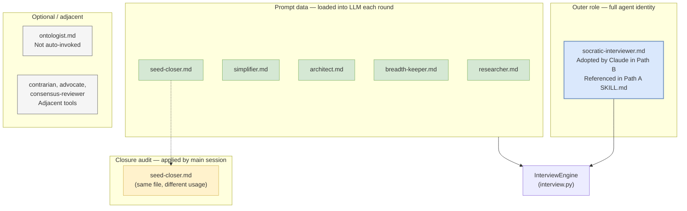

# 06 — Agents and roles

The interview skill uses agent markdown files in three different ways.
Understanding which is which is the single biggest rung to climb before
forking, because editing a file in one role has a completely different
effect than editing it in another.

## Three distinct usages



## 1. Outer role — `socratic-interviewer.md`

Path | Usage
---|---
Path A | **Reference material**: SKILL.md tells the main session to follow its methodology, but the actual question generation runs server-side in the MCP.
Path B | **Adopted role**: the main session "becomes" the socratic-interviewer and drives the interview in conversation.

File: `/Users/brandonwie/dev/personal/ouroboros/src/ouroboros/agents/socratic-interviewer.md`

Critical boundaries (`socratic-interviewer.md:5–15`):

> - You are ONLY an interviewer. You gather information through questions.
> - NEVER say "I will implement X", "Let me build", "I'll create" — you gather requirements only
> - NEVER promise to build demos, write code, or execute anything
> - Another agent will handle implementation AFTER you finish gathering requirements
>
> - You are a QUESTION GENERATOR. You do NOT have direct tool access.
> - The caller (main session) handles codebase reading and provides code context in answers.
> - Your job: generate the single best Socratic question to reduce ambiguity.
> - Do NOT reference specific files or code unless they appear in previous answers.

Response format rules (`:17–21`):

- Must always **end with a question** — never end without asking something.
- Keep questions focused (1–2 sentences).
- No preambles like "Great question!" or "I understand".
- If tools fail or return nothing, still ask a question based on what you know.

Brownfield prefix contract (`:23–30`) — the agent is told to read the
`[from-code]`, `[from-user]`, `[from-research]` prefixes and ask
intent-level questions instead of fact-finding ones. That is how the
routing decisions from [./02-routing-decision-tree.md](./02-routing-decision-tree.md)
change the agent's behaviour without changing its prompt.

Breadth control (`:39–44`) and stop conditions (`:46–49`) are what
the Dialectic Rhythm Guard and Seed-ready Acceptance Guard in
[./03-dialectic-rhythm.md](./03-dialectic-rhythm.md) enforce
programmatically.

## 2. Perspective prompts — loaded into the LLM each round

Five files under `src/ouroboros/agents/` are loaded as **prompt data**
by the interview engine:

```python
# interview.py:42–49
class InterviewPerspective(StrEnum):
    RESEARCHER = "researcher"
    SIMPLIFIER = "simplifier"
    ARCHITECT = "architect"
    BREADTH_KEEPER = "breadth-keeper"
    SEED_CLOSER = "seed-closer"

# interview.py:62–87 (loader)
@functools.lru_cache(maxsize=1)
def _load_interview_perspective_strategies() -> dict[...]:
    from ouroboros.agents.loader import load_persona_prompt_data
    mapping = {
        InterviewPerspective.RESEARCHER: "researcher",
        InterviewPerspective.SIMPLIFIER: "simplifier",
        InterviewPerspective.ARCHITECT: "architect",
        InterviewPerspective.BREADTH_KEEPER: "breadth-keeper",
        InterviewPerspective.SEED_CLOSER: "seed-closer",
    }
    return { ... }
```

The loader pulls three fields from each agent md file:

- `system_prompt` — the role description
- `approach_instructions` — bullets under `## YOUR APPROACH`
- `question_templates` — bullets under `## YOUR QUESTIONS`

Each perspective is selected at different stages of the interview
based on ambiguity milestone (see
[./04-ambiguity-scoring.md](./04-ambiguity-scoring.md)) and breadth
state. Per-perspective summary:

| Perspective | Role | When chosen | Signature question |
|-------------|------|-------------|--------------------|
| **researcher** | Investigation-first, evidence-based (`researcher.md:5–9`) | Early rounds with low context | "What information are we missing to solve this?" |
| **simplifier** | Scope-cutter; YAGNI enforcer (`simplifier.md:5–9`) | Mid-interview, when scope creep appears | "What's the simplest version of this that would work?" |
| **architect** | Structural thinker (`architect.md:5–9`) | When the problem surface suggests architectural misalignment | "Are we fighting the architecture or working with it?" |
| **breadth-keeper** | Multi-track ledger; prevents collapse onto one thread (`breadth-keeper.md:5–9`) | After several consecutive rounds on one thread | "Which unresolved tracks are still active besides the one we just discussed?" |
| **seed-closer** | Closure auditor (`seed-closer.md:5–9`) | When ambiguity score is near threshold and `SEED_CLOSER_ACTIVATION_THRESHOLD=0.25` is crossed | "Would another question change execution, or just polish wording?" |

**Implication for forking:** if you want to change how the interview
questions *feel* — more skeptical, more constructive, more
technical — you edit **those five files**, not Python. Because the
loader caches the strategies (`@functools.lru_cache(maxsize=1)` on
`_load_interview_perspective_strategies`), a process restart picks up
the change.

### The `approach_instructions` contract

Each file has a `## YOUR APPROACH` section with numbered stages. The
loader extracts the bullet text under each stage. The engine then
injects these into the scoring system prompt so the LLM "thinks
through" the listed stages before emitting a question. The pattern is
consistent across all five files — three to four numbered stages,
each with two to four bullets. Breaking this pattern (e.g., removing
the `## YOUR APPROACH` heading) will cause the loader to return an
empty `approach_instructions` tuple and the perspective will degrade
to "system prompt only".

## 3. Closure audit — `seed-closer.md`

The same `seed-closer.md` file appears in usage 2 (perspective
prompt) *and* in usage 3 (closure audit applied by the main session
at the end of each round). The difference is **who reads it**:

- In usage 2, the file is loaded server-side, distilled into prompt
  data, and fed into the LLM call that generates the next question.
- In usage 3, the file is read by the **main Claude session** to
  audit whether to accept an `seed_ready: true` signal from MCP.

Path A takes MCP's signal as advisory, not authoritative. From
`SKILL.md:218–231`:

> When MCP signals seed-ready, do NOT relay completion blindly.
> Before announcing completion or suggesting `ooo seed`, apply the
> canonical Seed Closer criteria from `src/ouroboros/agents/seed-closer.md`
> as the single source of truth for closure readiness. Run the check
> from the main session's perspective, including any code, research,
> or brownfield context MCP did not see.
>
> If any material decision remains unresolved, do not announce
> seed-ready. If the local challenge finds a material gap, explicitly
> override the MCP signal: `"MCP says seed-ready, but I am not
> accepting it yet because <gap>."`

Closure gate summary (`seed-closer.md:12–17`):

> - Treat a low ambiguity score as permission to audit closure, not
>   permission to close.
> - Do not close if any unresolved decision would materially change
>   implementation.
> - For brownfield or system-level work, check ownership/SSoT,
>   protocol or API contract, lifecycle/recovery, migration,
>   cross-client impact, and verification.
> - If code, research, or architecture context reveals a materially
>   different path, ask for the needed human decision instead of closing.

Key closure questions (`seed-closer.md:46–54`) — these are what a
forked interview should keep asking itself before accepting a close:

> - Is there any ambiguity left that would materially change
>   implementation?
> - Are scope, non-goals, outputs, and verification expectations
>   already clear enough for a Seed?
> - For brownfield or system-level work, are ownership, protocol/API
>   contract, lifecycle/recovery, migration, cross-client impact, and
>   verification clear enough to execute?
> - Did code or research reveal an alternative path that would change
>   implementation and needs a human decision?
> - Would another question change execution, or just polish wording?
> - Should we stop the interview here and move to seed generation?
> - What is the smallest remaining clarification needed before we can
>   proceed?

## 4. Optional / adjacent agents

### Ontologist

File: `/Users/brandonwie/dev/personal/ouroboros/src/ouroboros/agents/ontologist.md`

**Not auto-invoked by the interview skill.** It lives in the same
directory, can be referenced by the SKILL.md or by a user-triggered
subagent, and contributes the "Four Fundamental Questions"
(`ontologist.md:5–25`) that a fork might want to graft onto a
harder-edge interview:

1. **ESSENCE** — "What IS this, really?"
2. **ROOT CAUSE** — "Is this the root cause or a symptom?"
3. **PREREQUISITES** — "What must exist first?"
4. **HIDDEN ASSUMPTIONS** — "What are we assuming?"

These are complementary to the Socratic perspectives: the ontologist
goes deeper when the user's stated problem seems symptomatic. A fork
could load ontologist as a sixth `InterviewPerspective` by extending
the enum and mapping in `interview.py:42–87`.

### Other adjacent agents

Also in `src/ouroboros/agents/` but not part of the interview loop:

- `contrarian.md` — adversarial challenge role (used by `ooo unstuck`)
- `advocate.md` / `consensus-reviewer.md` / `judge.md` — used by
  evaluator and QA flows
- `codebase-explorer.md`, `code-executor.md`, `analysis-agent.md`,
  `research-agent.md` — worker roles for downstream skills
- `evaluator.md`, `qa-judge.md` — downstream evaluation agents
- `hacker.md`, `semantic-evaluator.md`, `ontology-analyst.md`,
  `seed-architect.md` — seed-generation-time / execute-time roles

None of these are read by the interview skill. Listing them here so a
forker knows which files they can safely leave behind.

## Role separation quick reference

| If you want to change ... | Edit this file | Related doc |
|---------------------------|----------------|-------------|
| How the agent answers the phone (Path B identity) | `socratic-interviewer.md` | 02, 03 |
| Question-generation skepticism | `researcher.md` | — |
| Scope-cutting aggressiveness | `simplifier.md` | — |
| Architectural depth of questions | `architect.md` | — |
| Multi-track ledger behaviour | `breadth-keeper.md` | 03 |
| Closure criteria | `seed-closer.md` (affects both usage 2 and 3) | 03 |
| Ontological-depth path | Extend `InterviewPerspective` + add ontologist to loader mapping | 04 |
| List of perspectives | `interview.py:42–87` | — |

See [./08-customization-guide.md](./08-customization-guide.md) for
the full fork matrix with line numbers.
