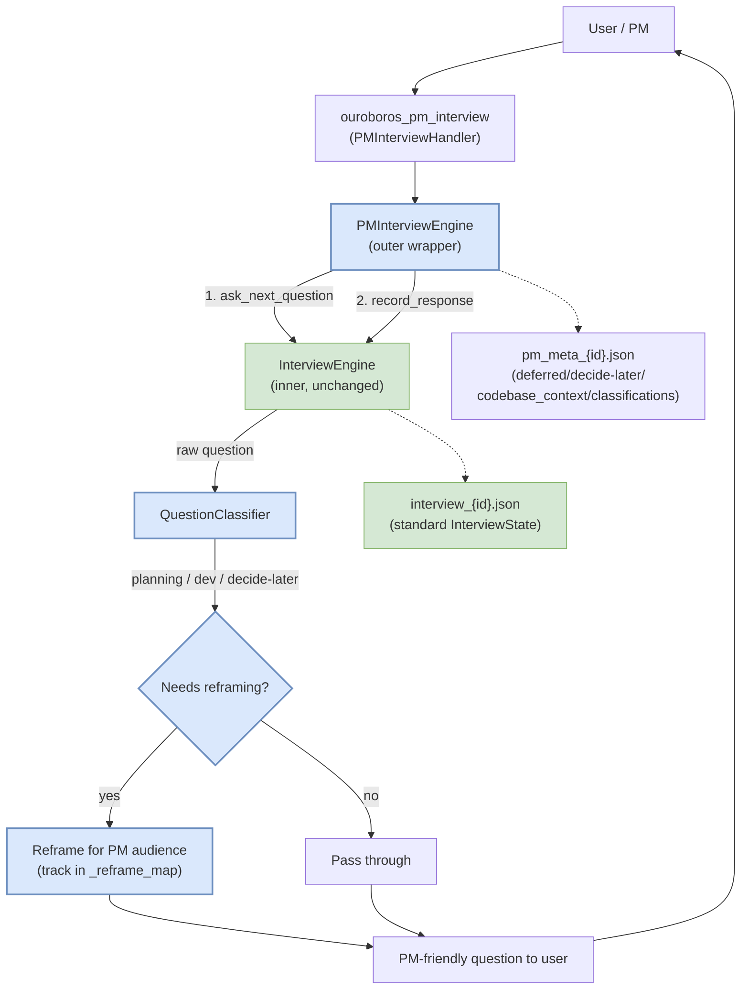

# 07 — PM variant

The `ouroboros_pm_interview` tool is a living example of how to fork
the interview without touching the core. Anyone extracting the skill
for a different audience (designers, researchers, support leads,
architects) can read the PM code as the canonical "how do I subclass
this?" reference.

## Why the PM variant exists

A PM writing a product spec is not trying to produce a `Seed` for code
generation. They want:

- a product goal
- user stories (persona / action / benefit)
- constraints and success criteria
- a list of **decide-later** items so premature technical questions
  don't freeze the conversation

None of that is in the standard `Seed` shape. The PM variant produces
a `PMSeed` instead — see below.

## The composition pattern

From `/Users/brandonwie/dev/personal/ouroboros/src/ouroboros/bigbang/pm_interview.py:1–14`:

> PM Interview Engine — composition wrapper around InterviewEngine.
>
> Adds PM-specific behavior on top of the existing InterviewEngine:
> - Question classification (planning vs development)
> - Reframing technical questions for PM audience
> - Deferred item tracking for dev-only questions
> - PMSeed generation from completed interview
> - Brownfield repo management via ~/.ouroboros/ouroboros.db
> - CodebaseExplorer scan-once semantics (shared context)
>
> Composition pattern: PMInterviewEngine *wraps* InterviewEngine
> without modifying its internals. The inner engine handles question
> generation, state persistence, and round management. The outer
> engine intercepts questions for classification and collects
> PM-specific metadata.



**The inner `InterviewEngine` is unmodified.** PM-specific behaviour
is either intercepted at the question boundary (classification +
reframing) or stored in a parallel metadata file
(`pm_meta_{session_id}.json`). That is the key insight for forking:
**you don't need to subclass; you wrap and annotate**.

## Files that participate

| Path | Size | Role |
|------|------|------|
| `src/ouroboros/bigbang/pm_interview.py` | 45.8K (1226 lines) | `PMInterviewEngine` — composition wrapper |
| `src/ouroboros/bigbang/question_classifier.py` | 12.4K | `QuestionClassifier`, `ClassificationResult`, `QuestionCategory`, `ClassifierOutputType` |
| `src/ouroboros/bigbang/pm_seed.py` | 9.1K | `PMSeed`, `UserStory` data classes |
| `src/ouroboros/bigbang/pm_document.py` | 16.6K | Renders PMSeed into a product document |
| `src/ouroboros/bigbang/pm_completion.py` | 2.0K | `maybe_complete_pm_interview`, `build_pm_completion_summary` |
| `src/ouroboros/mcp/tools/pm_handler.py` | 1588 lines | `PMInterviewHandler` MCP surface |
| `src/ouroboros/bigbang/interview.py` | (shared) | Unchanged — reused by composition |
| `src/ouroboros/bigbang/ambiguity.py` | (shared) | Unchanged — reused; `AmbiguityScorer` receives decide-later items as `additional_context` so they don't count against clarity |
| `src/ouroboros/bigbang/brownfield.py` + `explore.py` | (shared) | Shared brownfield exploration |

No fork of `InterviewEngine`, `InterviewState`, `AmbiguityScorer`,
`ambiguity.py`, or `seed-closer.md` was needed.

## Question classification

Each inner-generated question is fed through `QuestionClassifier` which
returns one of these categories (from
`bigbang/question_classifier.py` — `ClassifierOutputType` enum):

| Category | Behaviour |
|----------|-----------|
| `PLANNING` | Pass through to the PM as-is |
| `DEVELOPMENT` | Reframe for a PM audience; store mapping in `_reframe_map` so the original tech question is restored when the answer is sent back to the inner engine |
| `DECIDE_LATER` | Offer the user a "decide later" option; if chosen, add the original question to `decide_later_items` |
| `DEFERRED` | Auto-park (dev-only item surfaced later in the PM document) |

From `pm_interview.py:145–162`:

```python
deferred_items: list[str] = field(default_factory=list)
decide_later_items: list[str] = field(default_factory=list)
"""Original question text for questions classified as DECIDE_LATER.

These are questions that are premature or unknowable at the PM stage.
The main session presents the question to the user with a "decide later"
option; when chosen, the caller records the item here so the PMSeed
and PM document can surface them as explicit "decide later" decisions.
"""
classifications: list[ClassificationResult] = field(default_factory=list)
codebase_context: str = ""
_explored: bool = False
_reframe_map: dict[str, str] = field(default_factory=dict)
"""Maps reframed question text → original technical question text."""
```

The **classifications list** and **`_reframe_map`** together let the
PM engine reconstruct, at completion time, exactly which technical
questions became which user-facing questions — so the PM document
can show "you answered X, which addresses technical concern Y".

## Hard-coded prompt pieces

Unlike the main interview (which loads perspectives from markdown),
the PM variant ships with two hard-coded prompts in
`pm_interview.py:55–85`:

```python
_PM_SYSTEM_PROMPT_PREFIX = """\
You are a Product Requirements interviewer helping a PM define their product.

Focus on: goal, user stories, constraints, success criteria, assumptions.

"""

_OPENING_QUESTION = (
    "What do you want to build? Tell me about the product or feature "
    "you have in mind — the problem it solves, who it's for, and any "
    "initial ideas you already have."
)
```

And the extraction schema is pinned in `_EXTRACTION_SYSTEM_PROMPT`
(`:68–85`) — a JSON contract for the final PMSeed shape:

```json
{
  "product_name": "Short product/feature name",
  "goal": "High-level product goal statement",
  "user_stories": [
    {"persona": "User type", "action": "what they want", "benefit": "why"}
  ],
  "constraints": ["constraint 1", "constraint 2"],
  "success_criteria": ["criterion 1", "criterion 2"],
  "deferred_items": ["deferred item 1"],
  "decide_later_items": ["original question text for items to decide later"],
  "assumptions": ["assumption 1"]
}
```

**Forking note:** pinning the extraction schema in code is a
deliberate choice — it makes downstream tools (PM document renderer,
handoff builder) rely on a stable shape. A forker building a
similarly specific variant should pin their own schema the same way.

## State and output

| Artifact | Location | Content |
|----------|----------|---------|
| Standard interview state | `~/.ouroboros/data/interview_{id}.json` | Same `InterviewState` as main path |
| PM metadata | `~/.ouroboros/data/pm_meta_{session_id}.json` | `deferred_items`, `decide_later_items`, `codebase_context`, `pending_reframe`, `cwd`, `brownfield_repos`, `classifications`, `status` |
| PM seed | `~/.ouroboros/seeds/` (constant `_SEED_DIR` at `pm_interview.py:54`) | `PMSeed` JSON — product_name, goal, stories, constraints, success criteria, deferred, decide-later, assumptions |
| PM document | Rendered by `pm_document.py` | Human-readable product brief |

**Important asymmetry:** `_SEED_DIR = Path.home() / ".ouroboros" /
"seeds"` — the PM variant lives alongside the standard one, but
writes its seed to `seeds/`, not `data/`. A forker should decide up
front whether their variant's artifacts mix with the canonical ones
or live in a sibling namespace.

## MCP surface — `ouroboros_pm_interview`

`PMInterviewHandler` in `pm_handler.py` mirrors `InterviewHandler`
but with extra parameters for PM flows (repo selection, decide-later
confirmation, reframe pass-back). Notable extensions:

- **Diff computation** — before/after each
  `ask_next_question` call, the handler snapshots the lengths of
  `deferred_items` and `decide_later_items` and returns the new
  entries in the MCP response meta (`pm_handler.py:1–17`). This is
  how the client knows when to surface a new "decide later" dialog
  without reloading the whole list.
- **Brownfield repo management** — the handler adds a "select repos"
  sub-action that queries `BrownfieldStore` for known repos and
  stamps the chosen set onto the engine so subsequent rounds see
  consistent codebase context (`pm_handler.py:57`).
- **Subagent dispatch** — when running in plugin mode, the handler
  calls `build_pm_interview_subagent` to offload the actual engine
  work into an OpenCode Task pane, returning a delegation receipt to
  the main session
  (`pm_handler.py:42–48`). Same pattern as the main `InterviewHandler`.

## How decide-later items interact with ambiguity scoring

Because the PM variant intentionally parks questions instead of
answering them, the standard ambiguity scorer would otherwise
penalise the clarity score for "missing" information. The scorer
takes an `additional_context` parameter precisely for this:

From `ambiguity.py:302–304`:

> Items explicitly deferred via `additional_context` (e.g.
> decide-later items from a PM interview) are treated as
> **intentional deferrals** and must not reduce the clarity score.
> The LLM is instructed to score only what is present and answerable,
> not penalise deliberate gaps.

The PM handler assembles the decide-later list and passes it as
`additional_context` to the shared `AmbiguityScorer` — so the gate
logic stays identical to the main interview, but the scorer knows to
treat intentional parking as not-ambiguous. Without this contract,
PM interviews would be unable to reach `seed_ready`.

## Completion

PM interviews have their own completion surface in
`pm_completion.py`:

- `maybe_complete_pm_interview(state, engine) -> bool` — checks
  whether the underlying ambiguity + floors are satisfied AND the
  PM-specific checklist is complete.
- `build_pm_completion_summary(seed) -> str` — renders a summary that
  the MCP returns to the user as a `📍 Next:` message leading into
  the PM document generation step.

Under the hood it still defers to the shared
`qualifies_for_seed_completion` (see
[./04-ambiguity-scoring.md](./04-ambiguity-scoring.md)). The PM
variant does not weaken the gate — it wraps it.

## Fork checklist — "how to build my own variant"

Following the PM pattern:

1. **Wrap, don't subclass.** Create an outer engine that holds an
   inner `InterviewEngine` by composition and intercepts its
   `ask_next_question` output.
2. **Introduce a classifier** for the pieces of the dialogue that
   need domain-specific handling (for PM: planning vs dev vs
   decide-later). Store classifications alongside answers so you can
   reconstruct context later.
3. **Keep a reframe map** if you rewrite questions — the inner engine
   must see the *original* question text on `record_response` so
   ambiguity scoring stays coherent.
4. **Add a parallel metadata file** (`{variant}_meta_{id}.json`) for
   everything outside the base `InterviewState`. Do not extend
   `InterviewState` itself; let the inner engine stay generic.
5. **Pin your extraction schema** in a single constant, identical in
   shape to `_EXTRACTION_SYSTEM_PROMPT`, so downstream renderers have
   a stable contract.
6. **Mirror the handler boundary** (`pm_handler.py`) with variant
   parameters, diff computation in `meta`, and subagent dispatch for
   plugin mode.
7. **Reuse the ambiguity scorer** via `additional_context` for
   intentional deferrals so you don't re-derive the gate.
8. **Keep `seed-closer.md` as the closure audit** unless your domain
   genuinely needs different criteria — it's the canonical list.

Every item above maps to a file or function in the PM variant; the
matrix in [./08-customization-guide.md](./08-customization-guide.md)
points to exact lines.
