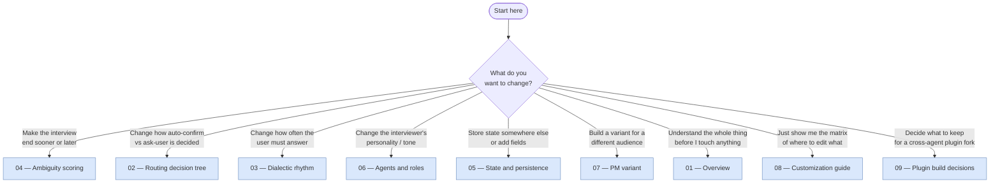

# Interview skill — extraction & customization docs

An analysis of the Ouroboros `interview` skill written so you can
fork it, customize it, and maintain your own version. **Analysis
only** — no source files are copied here; see
[./08-customization-guide.md](./08-customization-guide.md) for a
minimal-fork checklist when you are ready to actually extract.

## What is this doc set?

Eight topical markdown files plus this index. Each doc covers one
concern (scoring, routing, rhythm, state, agents, PM variant, …)
with:

- Verbatim quotes from the source with line numbers.
- Mermaid diagrams for anything that is a flow or state machine.
- A "what to edit" pointer into
  [./08-customization-guide.md](./08-customization-guide.md) at the
  end of each doc.

## Fork decision tree — "what do I want to change?"

## Reading order (top to bottom)

If you want a full tour rather than a jump-to-the-change:

1. **[01 — Overview](./01-overview.md)** — 5W1H, dual-path
   architecture, pipeline role, handoff contract, source map.
2. **[04 — Ambiguity scoring](./04-ambiguity-scoring.md)** — the
   five threshold constants, weighted formula, four milestones, gate
   logic. Self-contained numbers.
3. **[05 — State and persistence](./05-state-and-persistence.md)** —
   `InterviewState` schema, storage layout, MCP tool schema, event
   types, Path B no-persistence caveat.
4. **[02 — Routing decision tree](./02-routing-decision-tree.md)** —
   the five PATHs (1a/1b/2/3/4), Step 0 & 0.5 boot flow, the prefix
   contract, Path A vs Path B.
5. **[06 — Agents and roles](./06-agents-and-roles.md)** — three
   distinct usages of agent md files (outer role, perspective prompt
   data, closure audit), which files are loaded when.
6. **[03 — Dialectic rhythm](./03-dialectic-rhythm.md)** — the
   Dialectic Rhythm Guard (3-counter), the Seed-ready Acceptance
   Guard, stop conditions, ambiguity ledger.
7. **[07 — PM variant](./07-pm-variant.md)** — composition-not-
   subclassing pattern, QuestionClassifier, decide-later items,
   additional_context contract, fork checklist.
8. **[08 — Customization guide](./08-customization-guide.md)** —
   the fork matrix (one row per behaviour → exact file + line), the
   minimal-fork file list, verification steps.

## File index

| File | Purpose | Length |
|------|---------|--------|
| [./README.md](./README.md) | This index | ~90 lines |
| [./01-overview.md](./01-overview.md) | What, why, where it fits | ~170 lines |
| [./02-routing-decision-tree.md](./02-routing-decision-tree.md) | PATH 1a/1b/2/3/4, MCP vs fallback | ~220 lines |
| [./03-dialectic-rhythm.md](./03-dialectic-rhythm.md) | Rhythm guard, acceptance guard | ~185 lines |
| [./04-ambiguity-scoring.md](./04-ambiguity-scoring.md) | Threshold, weights, milestones, floors | ~170 lines |
| [./05-state-and-persistence.md](./05-state-and-persistence.md) | State model, MCP schema, events | ~220 lines |
| [./06-agents-and-roles.md](./06-agents-and-roles.md) | Outer role / perspectives / audit | ~210 lines |
| [./07-pm-variant.md](./07-pm-variant.md) | Composition fork template | ~220 lines |
| [./08-customization-guide.md](./08-customization-guide.md) | Fork matrix + min-fork checklist | ~200 lines |
| [./09-plugin-build-decisions.md](./09-plugin-build-decisions.md) | Cross-agent plugin decisions (Claude / Codex / Gemini) | ~400 lines |
| [./09-plugin-build-decisions.ko.md](./09-plugin-build-decisions.ko.md) | 크로스 에이전트 플러그인 결정 (한국어판) | ~400 lines |

## Key facts you can take away without reading further

- The interview skill has **two execution paths** — MCP (preferred,
  persistent) and agent fallback (in-conversation). Step 0.5 of
  SKILL.md uses `ToolSearch` to decide which.
- The **ambiguity gate is a compound check** — not just
  `score ≤ 0.2`. All per-dimension floors and a streak of 2
  consecutive seed-ready scores also have to pass.
- **Five perspectives** (researcher / simplifier / architect /
  breadth-keeper / seed-closer) are loaded from agent md files as
  prompt data every round. Those are the files you edit to change
  interviewer behaviour without touching Python.
- **The main Claude session can override MCP's seed-ready signal**
  using the canonical closure criteria in
  `src/ouroboros/agents/seed-closer.md`. MCP is not the final judge.
- **The PM variant is a composition wrapper**, not a subclass. Your
  own variants should follow the same pattern — wrap
  `InterviewEngine`, intercept questions at the handler boundary,
  store variant-specific state in a parallel metadata file.

## Maintenance notes

- These docs reference line numbers in the upstream Ouroboros repo at
  `/Users/brandonwie/dev/personal/ouroboros`. If upstream moves, run
  a grep on the quoted constant (e.g., `AMBIGUITY_THRESHOLD`) or
  section header (e.g., `#### Dialectic Rhythm Guard`) to relocate.
- All cross-references use relative markdown paths. Keeping the file
  names unchanged (or updating the `related:` frontmatter arrays
  when renaming) keeps the graph closed.
- All frontmatter uses `status: in-progress`. Flip to `completed`
  once you have applied the docs to an actual fork and know they are
  accurate for your derived version.
