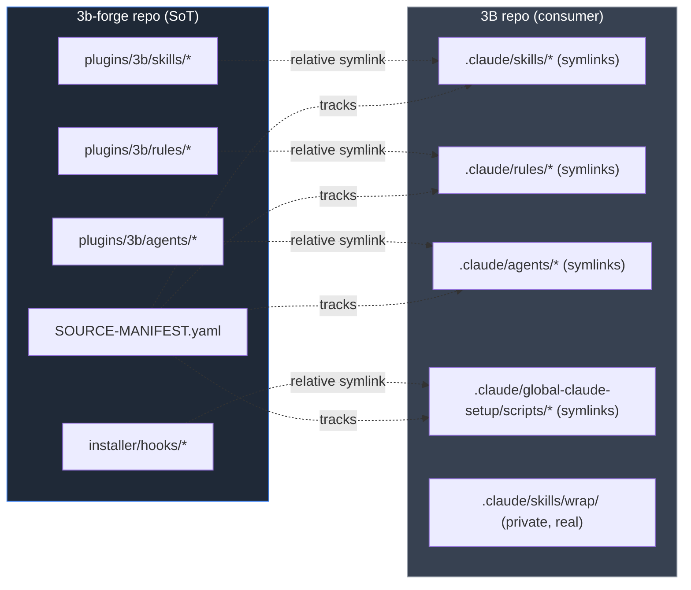

# 3b — the consolidated 3b-forge plugin

Single Source of Truth for the forge. One plugin, many skills, rules, and
agents. Works across Claude Code, Codex, Gemini CLI, and any future AI agent
host that can read markdown-based skills.

> **Status:** `v0.0.4` — **pre-release**. Wave 3 SSoT flip landed
> 2026-04-24; forge owns the 18 manifest entries, 3B consumes via
> relative symlink. See [SSoT topology](#ssot-topology-wave-3).

## Current skills

Every skill is invoked as `/3b:{skill_name}` in Claude Code (plugin dir name
drives the slash prefix).

| Slash | What it does | File |
|---|---|---|
| `/3b:interview` | Socratic interview: turns a vague request into a concrete spec via rotating-perspective questioning | [`skills/interview/SKILL.md`](./skills/interview/SKILL.md) |
| `/3b:clarify` | Resolve requirement / intent / strategic uncertainty through hypothesis-driven questioning | [`skills/clarify/`](./skills/clarify/) |
| `/3b:investigate` | Parallel-search investigation across codebase / git / docs with confidence-rated hypothesis | [`skills/investigate/`](./skills/investigate/) |
| `/3b:review-pr` | 3-agent PR review across 7 categories (security, quality, performance, architecture, tests, maintainability, deploy safety) | [`skills/review-pr/`](./skills/review-pr/) |
| `/3b:pr-creator` | Create GitHub pull requests with structured bilingual (EN/KO) notes | [`skills/pr-creator/`](./skills/pr-creator/) |
| `/3b:issue-creator` | Create GitHub issues with Conventional-Commit title + bilingual body | [`skills/issue-creator/`](./skills/issue-creator/) |
| `/3b:add-pr-self-reviews` | Post self-review inline comments explaining implementation decisions on the PR diff | [`skills/add-pr-self-reviews/`](./skills/add-pr-self-reviews/) |
| `/3b:validate-pr-reviews` | Triage AI-reviewer comments (Claude / Copilot / Codex) — classify valid / invalid / controversial | [`skills/validate-pr-reviews/`](./skills/validate-pr-reviews/) |
| `/3b:doc-audit` | Audit docs for stale references, broken links, missing cross-references | [`skills/doc-audit/`](./skills/doc-audit/) |
| `/3b:graphify` | Any input (code / docs / papers / images) → clustered knowledge graph (HTML + JSON + audit) | [`skills/graphify/`](./skills/graphify/) |
| `/3b:translate-ko` | Translate English → natural Korean (blog, PR, docs, general) | [`skills/translate-ko/`](./skills/translate-ko/) |
| `/3b:task-tracker` | Detect recurring task patterns after completion; suggest skill/hook/command automation | [`skills/task-tracker/`](./skills/task-tracker/) |

More skills will join under `/3b:<name>` as the forge grows.

## Methodology rules (auto-loaded)

The plugin ships 13 `rules/` files that auto-load per Claude Code's
path-gated injection (each rule declares `paths:` in its frontmatter to
control when it loads; rules without `paths:` load universally).

| Rule | Scope |
|---|---|
| `change-discipline.md` | Scope, commit, root-cause verification, friction lifecycle (universal) |
| `pr-review-lifecycle.md` | review-pr ↔ validate-pr-reviews severity map (universal) |
| `yaml-frontmatter-schema.md` | Frontmatter contract (universal) |
| `tag-taxonomy.md` | Canonical tag vocabulary (universal) |
| `knowledge-creation.md` | 5W1H + Zettelkasten recipe (`knowledge/**`) |
| `tmp-files.md` | Scratch-dir discipline (`tmp/**`) |
| `reference-credibility.md` | Sourcing rubric (`knowledge/**`) |
| `runtime-environment.md` | asdf + brew strategy (`.tool-versions`, `Brewfile`, `package.json`) |
| `firecrawl-usage.md` | Web-scrape tool routing (`**/*firecrawl*`) |
| `claude-settings-lookup.md` | settings.json resolution order (`**/settings.json`) |
| `task-starter-post-plan.md` | Plan → implementation transition gate |
| `blog-publishing.md` | Knowledge-to-blog workflow |
| `dotfiles-management.md` | Dotfiles layout (`dotfiles/**`) |

## Agents

| Agent | Role |
|---|---|
| [`socratic-interviewer`](./agents/socratic-interviewer.md) | Outer interview role |
| [`seed-closer`](./agents/seed-closer.md) | Closure audit |
| [`researcher`](./agents/researcher.md) | Research perspective |
| [`simplifier`](./agents/simplifier.md) | Simplification perspective |
| [`architect`](./agents/architect.md) | Architecture perspective |
| [`breadth-keeper`](./agents/breadth-keeper.md) | Scope-breadth perspective |
| [`ontologist`](./agents/ontologist.md) | Ontology perspective (beyond upstream) |
| [`claude-forge-crosschecker`](./agents/claude-forge-crosschecker.md) | Compare gathered material against prior extracted guides (lineage: merged `claude-forge` project) |

## Two layers, one plugin (interview)

### Conversational layer (default)

The interview skill runs as a pure-markdown playbook. The host conversation IS
the engine. Zero runtime dependencies. Any agent host that can read this
plugin's files can run the skill.

**Entry points:**

- [`skills/interview/SKILL.md`](./skills/interview/SKILL.md) — the playbook.
- [`agents/`](./agents/) — the seven role prompts loaded per round.
- [`skills/interview/references/`](./skills/interview/references/) — per-host
  tool-name mappings (Claude Code `Read`/`Write`, Codex and Gemini equivalents).

### Programmatic layer (optional)

For integrators building CLIs, servers, or automations on top of the
interview skill, the [`engine/`](./engine/) subdir ships a Python package
(`interview_plugin_core`) that wraps the same agents + playbook as an async
engine with pluggable `LLMAdapter`, numeric ambiguity scoring (0–1),
file-locked `InterviewState` persistence, and 60+ pytest-asyncio tests.

The engine loads its prompts from the same [`agents/`](./agents/) directory
used by the conversational layer — there is no duplication.

**If you don't need programmatic access, ignore the `engine/` folder
entirely.**

## SSoT topology (Wave 3)

Forge is Single Source of Truth for the 18 manifest entries. The 3B repo
(maintainer's private knowledge tree) holds relative symlinks into forge
instead of its own copies. Future edits to shared skills / rules / agents /
hooks happen once, in forge. 3B-private content (wrap, clean-actives,
task-starter, etc.) stays as real files in 3B.



**Migration tooling:**

- [`../../scripts/flip-to-forge.sh`](../../scripts/flip-to-forge.sh) —
  performs the flip (`--dry-run` / `--execute` / `--rollback`).
- [`../../scripts/check-3b-drift.sh`](../../scripts/check-3b-drift.sh) —
  post-flip integrity checks (symlink integrity, wrong targets, untracked
  candidates, reintroduced hardcoded paths, plugin-reinstall damage).
- [`PUBLIC-PRIVATE-SPLIT.md`](./PUBLIC-PRIVATE-SPLIT.md) — tier rubric
  (Tier A = in manifest; Tier B = candidate; Tier C = 3B-private).

## Per-host manifests

| Host | Manifest | Discovery |
|---|---|---|
| Claude Code | [`.claude-plugin/plugin.json`](./.claude-plugin/plugin.json) | Standard plugin marketplace |
| Codex | [`.codex-plugin/plugin.json`](./.codex-plugin/plugin.json) | Codex skill loader |
| Gemini CLI | (future) | TBD — plugin format evolving |

All manifests declare the same plugin `name: "3b"` and point to the same
`skills/` directory. The only per-host difference is the manifest schema
itself.

## Graduation criterion (v0.0.2 → v0.1.0)

Bump to `v0.1.0` when ready-to-use-out-of-the-box as a forge library:

1. Perspective-rotation decision table in SKILL.md is empirically validated
   (golden transcripts produce expected agent activations).
2. `seed-closer.md` has per-dimension observable-signal rubric.
3. Session continuity convention (transcript path under `projects/*/actives/`)
   is documented and exercised.
4. Cross-host install flow tested end-to-end on Claude Code + Codex (Gemini
   support remains best-effort until its plugin format stabilizes).
5. At least 2 golden transcript fixtures under `plugins/3b/fixtures/`
   (greenfield + brownfield).
6. Python engine's ontologist perspective lands and its tests pass.
7. Wave 2 landing: all Tier-B skills parameterized and moved from gitignored
   to public (see [`PUBLIC-PRIVATE-SPLIT.md`](./PUBLIC-PRIVATE-SPLIT.md)).

## File layout

```
plugins/3b/
├── .claude-plugin/plugin.json        # Claude Code manifest
├── .codex-plugin/plugin.json         # Codex manifest
├── PUBLIC-PRIVATE-SPLIT.md           # Maintainer policy doc (gitignore rubric)
├── commands/
│   └── interview.md                  # /3b:interview slash stub
├── skills/
│   ├── interview/                    # SSoT interview engine
│   ├── clarify/
│   ├── investigate/
│   ├── review-pr/
│   ├── pr-creator/
│   ├── issue-creator/
│   ├── add-pr-self-reviews/
│   ├── validate-pr-reviews/
│   ├── doc-audit/
│   ├── graphify/
│   ├── translate-ko/
│   └── task-tracker/
├── agents/                           # 8 role prompts
│   ├── socratic-interviewer.md
│   ├── seed-closer.md
│   ├── researcher.md
│   ├── simplifier.md
│   ├── architect.md
│   ├── breadth-keeper.md
│   ├── ontologist.md
│   └── claude-forge-crosschecker.md
├── rules/                            # 13 methodology rules
├── engine/                           # optional Python engine
│   ├── pyproject.toml
│   ├── src/interview_plugin_core/
│   └── tests/
└── README.md                         # this file
```

## Upstream

Forked from the `interview` skill in
[Q00/ouroboros](https://github.com/Q00/ouroboros). Upstream carries the
original Socratic methodology, five-perspective model, and numerical
ambiguity-scoring design. The 3b consolidation adds the ontologist
perspective and the cross-agent manifest layer.

## License

MIT. See [`../../LICENSE`](../../LICENSE).
