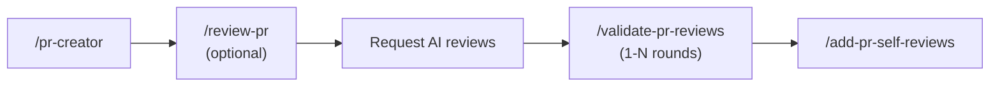

# PR Review Lifecycle

Unified reference for PR-related skills. All skills point here for lifecycle
position, severity mapping, and shared conventions.

## Pipeline

## Skill Responsibilities

| Skill                  | Role                             | Input           | Output                                             | Task Folder          |
| ---------------------- | -------------------------------- | --------------- | -------------------------------------------------- | -------------------- |
| `/pr-creator`          | Create PR with bilingual notes   | Commits, branch | GitHub PR                                          | No                   |
| `/review-pr`           | Proactive 3-agent code review    | PR diff         | `proactive-review.md`                              | Yes (creates)        |
| `/validate-pr-reviews` | Classify AI reviewer comments    | GitHub comments | `round-{N}-review.md`                              | Yes (creates/reuses) |
| `/add-pr-self-reviews` | Post explanatory inline comments | PR diff         | GitHub review + optional `self-review-comments.md` | Optional             |

## Severity ↔ Classification Mapping

`/review-pr` outputs severity levels; `/validate-pr-reviews` consumes them in
Phase 1.5 dedup and uses classification labels. Canonical mapping:

| Proactive Severity | Reactive Classification | Dedup Behavior                                                   |
| ------------------ | ----------------------- | ---------------------------------------------------------------- |
| CRITICAL           | VALID BUG               | Auto-mark AI comment as DUPLICATE if same file ±5 lines          |
| HIGH               | VALID IMPROVEMENT       | Auto-mark AI comment as DUPLICATE if same claim                  |
| MEDIUM             | CONTROVERSIAL           | Flag for user — proactive triage may differ from AI opinion      |
| LOW                | GOOD-TO-HAVE            | Flag for user — low severity ≠ invalid                           |
| INFO               | (no equivalent)         | Logged only in proactive review; not matched against AI comments |

## Task Folder Convention

Location: `{project_repo}/docs/actives/{task_name}/`

- Must be gitignored (process artifacts, not committed)
- Created by `/review-pr` Phase 0 or `/validate-pr-reviews` Step 0
- Resolution algorithm: match branch name → existing folder (strip
  `feat/`/`fix/` prefix)
- If no match → ask user (create or select)

## Shared Artifacts

| File                      | Created By                        | Read By                                    |
| ------------------------- | --------------------------------- | ------------------------------------------ |
| `proactive-review.md`     | `/review-pr`                      | `/validate-pr-reviews` (Phase 1.5 dedup)   |
| `round-{N}-review.md`     | `/validate-pr-reviews`            | `/validate-pr-reviews` (cross-round dedup) |
| `self-review-comments.md` | `/add-pr-self-reviews` (optional) | —                                          |

## GitHub Comment Policy

**Per-thread replies only.** No round summary comments, no combined status
updates as PR conversation comments. All round-level tracking stays in local
files. See `/validate-pr-reviews` § "GitHub Comment Policy" for full rules.

## `/review-pr` Is Optional

Small/trivial PRs don't need 3-agent proactive review. `/pr-creator` Step 8
offers it but supports "Skip". The pipeline works without it —
`/validate-pr-reviews` Phase 1.5 gracefully handles missing
`proactive-review.md`.

## Legacy: `custom:pr-review`

**Deprecated.** Superseded by `/validate-pr-reviews`. The command file redirects
to this lifecycle document.
